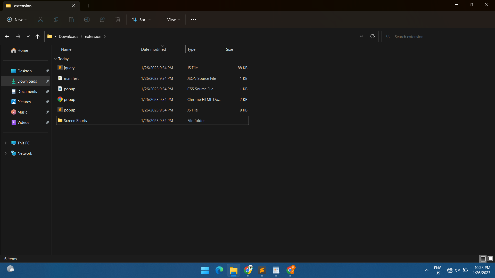
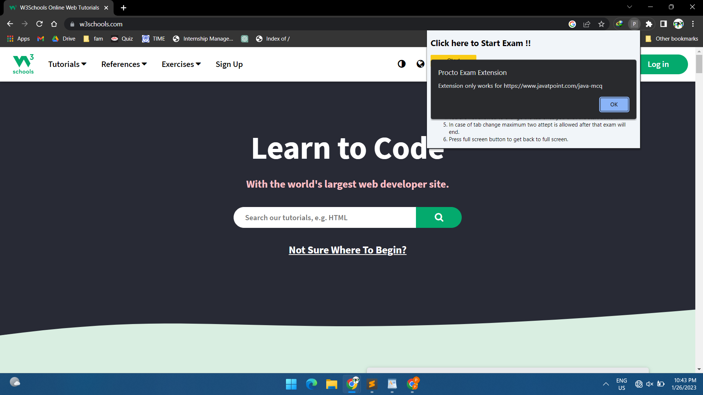
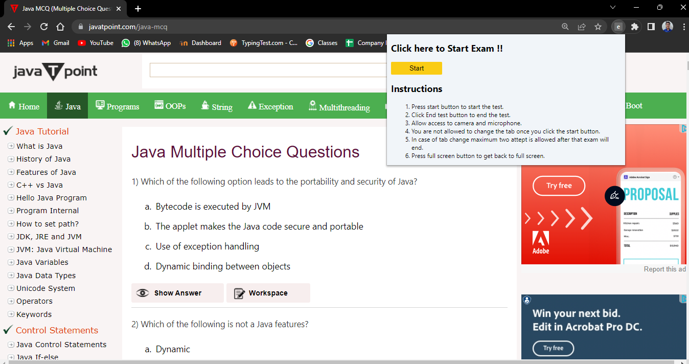
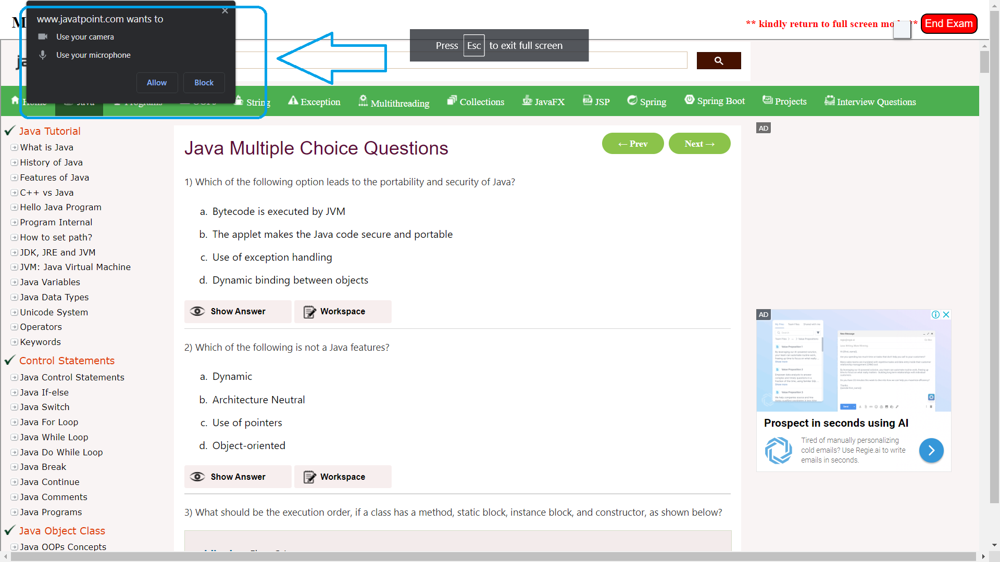
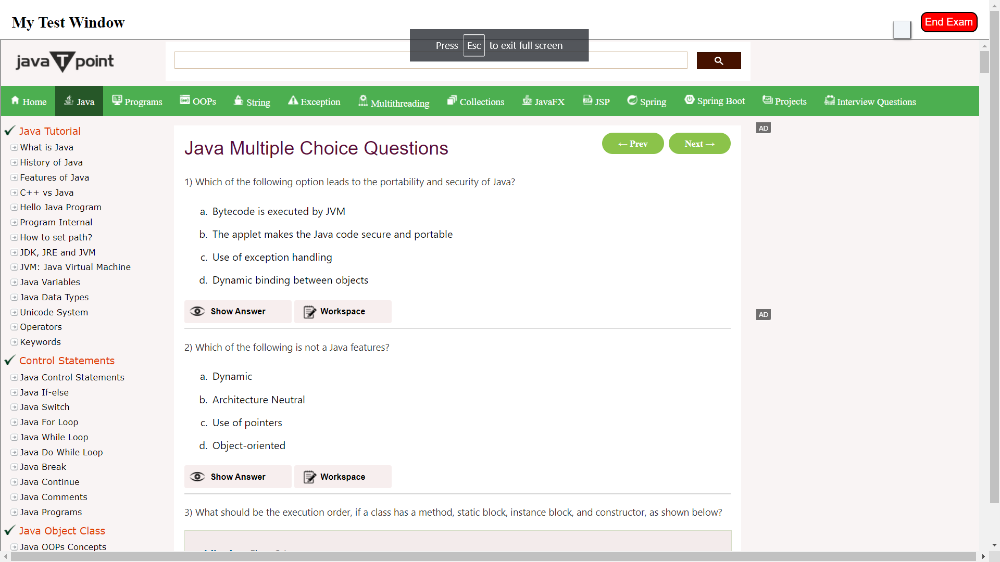
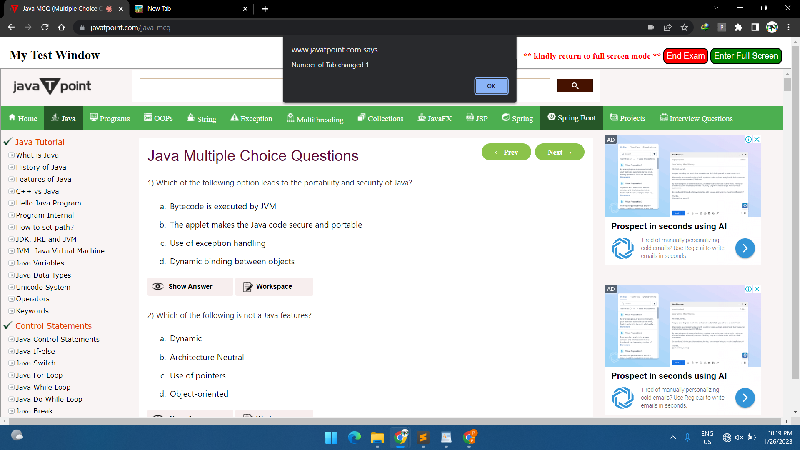
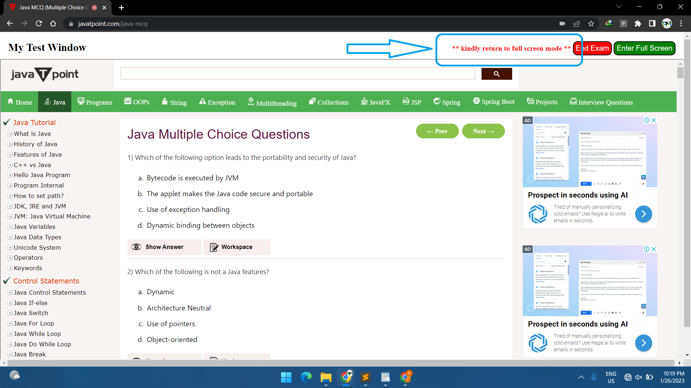

# Procto Exam Extension

This extension is developed using JavaScript as backend and HTML/CSS as frontend.

# Detailed steps to set up the project.

#### 1 Clone project from github

#### 2 Install the unpacked extension in Chrome 

To install the extension manually, you need to unzip the extension first. Follow the steps to load the unpacked extension.

a. Go to Chrome Settings using three dots in the top right corner.\
b. Then Select Extensions.\
c. Now, Enable developer mode\
d. Click on Load Unpacked and select your Unzip folder.\
e. The extension will be installed now.

#### 3 Go to https://www.javatpoint.com/java-mcq Since in the assignment it was asked that the extension should work, a selected url.

#### 4 If a user tries to use the extension on a different page, then the following alert will get displayed.

#### 5 On clicking the extension, a popup will be displayed which consists of a start button along with instructions for the test.

#### 6 Click on the start button to start the exam.

#### 7 Now a popup will be displayed asking for access to the camera and microphone.

#### 8 Now the window will open in full screen mode and the exam will get started.

#### 9 User Internet, Microphone, Camera status are being recoded in the local storage.

#### 10 Now if a user tries to change the tab, an alert will be thrown displaying the number of tab switches. 

#### 11 If the count exceeds 2, then the exam will automatically end.

#### 12 If, by fault, the user comes out of the full screen mode a warning will be shown and the user can get back to full screen by clicking the full screen button.

#### 13 Once an exam gets completed, the user can end the exam by clicking the end exam button and an alert will be shown showing the exam completed successfully.

# Features

The following features are added in the extension

- [x] Extension should work only in selected URLs(test page) during a certain time/trigger.

- [x] The browser should open in full screen mode.

- [x] Pop-up should be shown when someone switches between 2 tabs or applications.

- [x]     More than one tab can’t be opened.

- [x] Users should not be able to close the tab with the normal close button [shortcut keys should not work too]. (User should only be able to close tab by clicking on “End Test” Button)

- [x] Should do requirement check initially when extension is activated:

    - [x] Audio

    - [x] b.Camera

    - [x] c.Internet Stability

- [x] Capture the user-related information in local storage.(requirements check)

