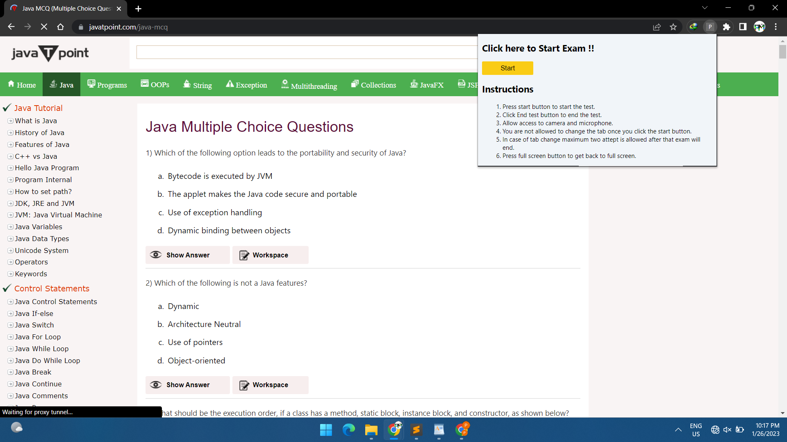

# Procto Exam Extension

This extension is devloped using javascript as backend and HTML/CSS  as frountend.

# Detailed steps to set up the project.
#### 1 Clone project from github

#### 2 Install the unpacked extension in Chrome 
To install extension manually you need to unzip the extension first. Follow the steps to load the unpacked extension.

a. Go to Chrome Settings using three dots on the top right corner.\
b. Then Select Extensions.\
c. Now, Enable developer mode\
d. Click on Load Unpacked and select your Unzip folder.\
e. The extension will be installed now.

#### 3 Go to https://www.javatpoint.com/java-mcq Since in the assignment it was asked that the extension should work a select url.

#### 4 If user tries to use extension on different page then following alert will get displaced

#### 5 On clicking on extension a popup will get displayed which consist of start button along with Instruction for the test.

#### 6 Click on the start button to start exam.

#### 7 Now a popup will be displayed asking for access for camera and microphone.

#### 8 Now the window will open in full screen mode and exam will get started.

#### 9 User Internet, Microphone, Camera status are being recoded in the local storage.

#### 10 Now if user try to change the tab a alert will be thrown dispalying the number of tab switches 

#### 11 If count get exceedes 2 then the exam will get automatically end.

#### 12 If by fault the user comes out of the full screen mode a warning will be shown and user can get back to full screen by clicking full screen button.

#### 13 Once exam get completed user can end the exam by clicking end exam button and a alert will be shown showing exam completed successfully

# Features
Following feature are added in the extension

- [x] Extension should work only in selected URLs(test page) during a certain time/trigger.
- [x] The browser should open in full screen mode.
- [x] Pop up should be shown when someone switches between 2 tabs or Application.
- [x] 	More than one tab can’t be opened.
- [x] Users should not be able to close the tab by the normal close button [shortcut keys should not work too]. (User should only be able to close tab by clicking on “End Test” Button)
- [x] Should do requirement check initially when extension is activated:
    - [x] Audio
    - [x] b.Camera
    - [x] c.Internet Stability
- [x] Capture the user related information in local storage.(erequirements check)
